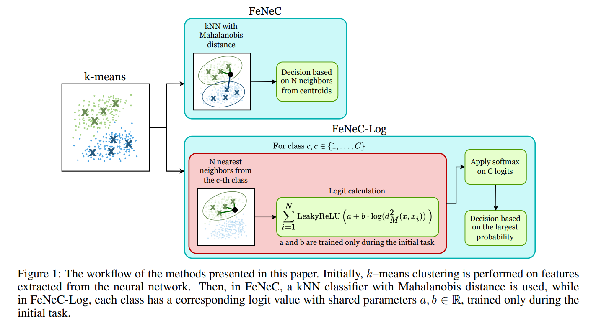

# [FeNeC: Enhancing Continual Learning via Feature Clustering with Neighbor- or Logit-based Classification](https://arxiv.org/abs/2503.14301) [](https://arxiv.org/abs/2503.14301)

[](https://arxiv.org/abs/2503.14301)

## Abstract

The ability of deep learning models to learn continuously is essential for adapting to new data categories and evolving data distributions. In recent years, approaches leveraging frozen feature extractors
after an initial learning phase have been extensively studied. Many of these methods estimate per-class
covariance matrices and prototypes based on backbone-derived feature representations. Within this
paradigm, we introduce FeNeC (Feature Neighborhood Classifier) and FeNeC-Log, its variant based
on the log-likelihood function. Our approach generalizes the existing concept by incorporating data
clustering to capture greater intra-class variability. Utilizing the Mahalanobis distance, our models
classify samples either through a nearest neighbor approach or trainable logit values assigned to
consecutive classes. Our proposition may be reduced to the existing approaches in a special case
while extending them with the ability of more flexible adaptation to data. We demonstrate that two
FeNeC variants achieve competitive performance in scenarios where task identities are unknown and
establish state-of-the-art results on several benchmarks.

## Cite

```
@misc{ksiazek2025fenec,
        title={FeNeC: Enhancing Continual Learning via Feature Clustering with Neighbor- or Logit-Based Classification}, 
        author={Kamil Książek and Hubert Jastrzębski and Bartosz Trojan and Krzysztof Pniaczek and Michał Karp and Jacek Tabor},
        year={2025},
        eprint={2503.14301},
        archivePrefix={arXiv},
        primaryClass={cs.LG},
        url={https://arxiv.org/abs/2503.14301}, 
}
```

## Alternative FeNeC implementation

There you can find the alternative version of FeNeC code:
https://github.com/gmum/FeNeC

## Quick start

First clone the repository using git and after that enter the FeNeC directory
```bash
git clone https://github.com/btrojan-official/FeNeC.git
cd FeNeC
```
Then you need to setup Python enviroment

### Windows

```powershell
python3 -m venv .venv
.venv/Scripts/activate
pip install -r requirements.txt
```

### Linux

```bash
python3 -m venv .venv
source .venv/bin/activate
pip install -r requirements.txt
```

**Warning:** If you don't have cuda on your device, or you want to run code on other version of cuda than 12.4 you should manully change torch version in requirements.txt file!

If you have already prepared the virtual enviroment, don't forget to activate it with commands below.

### Windows

```powershell
.venv/Scripts/activate
```

### Linux

```bash
source .venv/bin/activate
```

## Input Data Structure

Method **FeNeC.fit** that fits our model to training data takes two arguments:
- X_train - train data of shape (num_train_samples, num_features)
- y_train - train data labels of shape (num_train_samples, num_features)

Method **FeNeC.predict** that predicts the class of given test samples takes one argument:
- X_test - test data of shape (num_test_samples, num_features)

## Example Training Loop

After setting up you can run jupyter notebook with example training and evaluating loop: **train_and_eval.ipynb** file. It uses **config.py** from *configs* directory as configuration for model.

## FeNeC implementation

The actual FeNeC model code is in the **model.py** file. With some other helper functions in files in *utils* directory.

## Contact

Contact with the authors of this code:
- bartosztrojanofficial@gmail.com
- contact@michalkarp.pl

Or other authors of this paper:
- kamil.ksiazek@uj.edu.pl
- h.jastrzebski@student.uj.edu.pl
- krzysiek.pniaczek@outlook.com
- jacek.tabor@uj.edu.pl